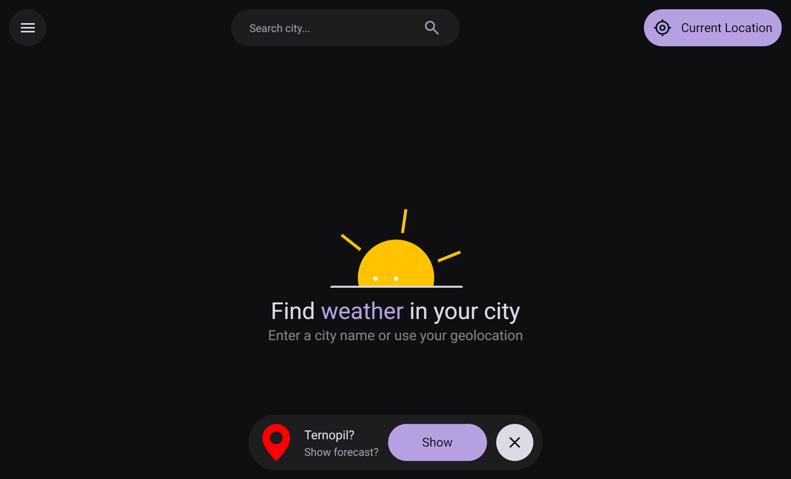
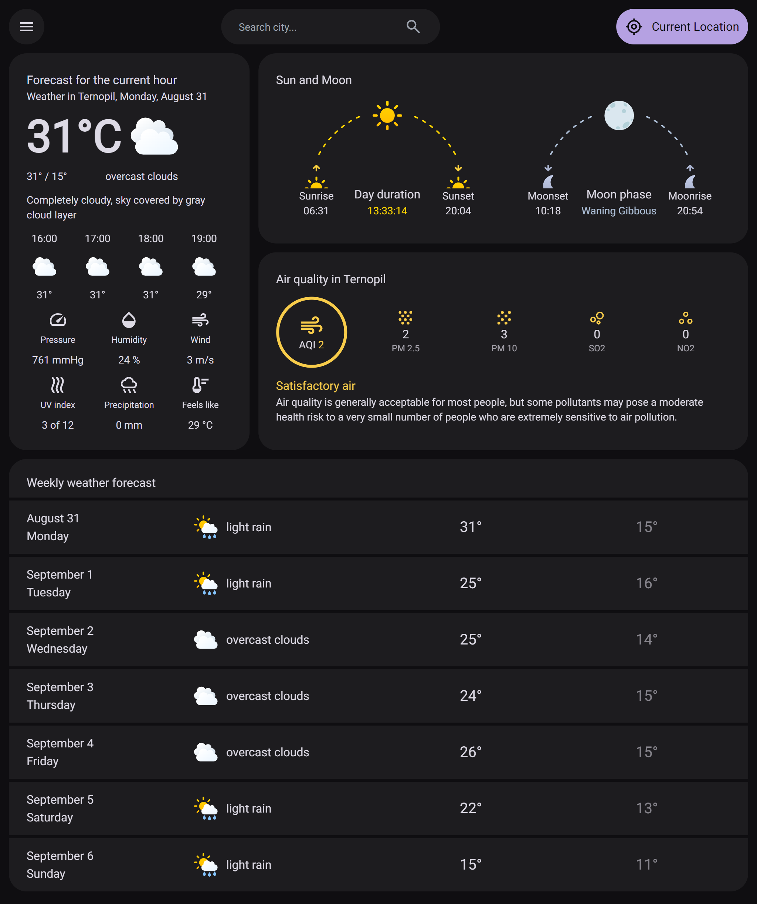

# About Weatherly

[**Weatherly**](https://weatherly-forecast.vercel.app) is a web application that provides real-time weather information. Also provides detailed astronomical data, air quality, and weekly weather forecasts.

## 📷 Screenshots

<div align="center">
  <h3>Home Page</h3>
  
  <h3>Weather Page</h3>
  
</div>

## ✨ Features

- **Real-Time Weather:** Live weather updates and current atmospheric conditions for any location.
- **Detailed Metrics:** Air Quality Index (AQI), pressure, humidity, wind speed, and UV index.
- **Astronomical Data:** Sunrise, sunset, moonrise, moonset, and moon phase tracking.
- **Weekly Forecast:** Multi-day weather predictions with detailed metrics.
- **Dynamic Switcher:** Instant switching between measurement units (°C/°F) and languages without page reload or extra API calls.
- **Search & Caching Optimization:** Smart API query caching, search history, and debouncing for enhanced performance.
- **Geolocation & Fast Notifier:** Auto-detecting user position with fast location notification fallback.
- **Accessibility (a11y):** Built with ARIA attributes and full keyboard navigation support.

## 🛠️ Tech Stack

- **Frontend:** React, TypeScript
- **State Management:** MobX
- **Styling:** TailwindCSS
- **Localization:** react-i18next
- **API Integration:** OpenWeather API, Fetch API
- **Build Tooling:** Vite

## 📁 Project Structure

```text
src/
├── assets/                        # Lottie animations (home, loading states, errors)
├── components/
│   ├── Header/                    # Search features and geolocation controls
│   ├── Main/                      # Main weather dashboard content
│   ├── FastLocationNotifier.tsx
│   ├── Settings.tsx
│   └── SideMenu.tsx
├── services/                      # OpenWeather API integrations, geolocation, and local cache
│   ├── storage/
│   ├── geocoding.ts
│   └── location.ts
├── shared/
│   ├── hooks/                     # Custom React hooks (scroll handling, keyboard navigation)
│   ├── localization/              # i18n configurations and translation files (UA / EN)
│   ├── types/
│   ├── ui/                        # Basic UI primitives (buttons, icons, modals, portals)
│   └── utils/
├── store/
│   ├── forecast/                  # Stores: (Current weather, AQI, Astronomy, Weekly)
│   ├── requestStore.ts            # Global loading and error state handling
│   └── settingsStore.ts           # User settings and application state
├── App.tsx
└── main.tsx
```

## ⚙️ Installation & Setup

1. **Clone the repository:**

```bash
git clone https://github.com/andrii-kaliuha/weatherly.git

```

2. **Go to the Folder:**

```bash
cd weatherly

```

3. **Install dependencies:**

```bash
npm install

```

4. **Set up environment variables:**
   Create a `.env` file in the root directory and add your OpenWeather API key:

```env
WEATHER_API_KEY=your_openweather_api_key_here

```

5. **Run development server:**

```bash
npm run dev
```

> **Note: Fast Location Notifier**  
> Automatic IP-based geolocation in the `Fast Location Notifier` component relies on Vercel headers (`x-vercel-ip-latitude` / `x-vercel-ip-longitude`).
>
> - **Local (`localhost`):** Uses fallback coordinates (Kyiv: `50.4501, 30.5234`).
> - **Production (Vercel):** Detects location automatically based on the user's IP.

## 📦 Build

```bash
npm run build
```

## 🚀 Future Improvements

- **Next.js Migration:** Move to Next.js (App Router) with SSR for faster speed.
- **URL-Based State:** Keep city and language in the URL for easy sharing.
- **Dynamic OG Previews:** Generate preview images automatically for social links.
- **UI Redesign:** Update the design to make it look clean and modern.
